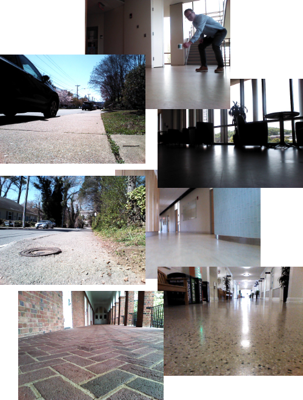

# ROSbot Dataset Collection

<p float="middle">
  
   
</p>

This repository contains instructions and source code for using the ROSbot to collect a dataset by driving around using the Husarion ROSbot XL.
It contains instructions to install, troubleshoot, and initialize the onboard data collection routine for the ROSbot.
It also contains training scripts for a DAVE2 steering model and pytorch implmentations of other architectures.


## Links
Pretrained models: https://drive.google.com/drive/folders/1lTqEC30yBuqN6IobSV73E97OaOnCGqDg?usp=sharing

Dataset: https://drive.google.com/drive/folders/1Zn7ZNDpPpw7ffnotwR8Jb-DGITRNZy0A?usp=sharing

Failure catalog: https://drive.google.com/drive/folders/1Lntd0lctZ05JxOc6pdGFCkYDMpMbI_cN?usp=sharing

Supplemental video available [via youtube](https://youtu.be/qgvO_J_3u14)

## Directory structure

```bash
.
├── install.sh
├── README.md
├── requirements.txt
├── navigation_models
│   ├── data_cleaning
│   │   ├── clean_rosbot_data.py
│   │   └── data_cleaning.md
│   ├── data_graphing
│   │   ├── extract_loss_values_pub.py
│   │   ├── get_angular_speeds_pub.py
│   │   ├── graph_loss_pub.m
│   │   └── make_histogram_pub.m
│   ├── model_inference
│   │   ├── inference.sh
│   │   ├── model_inference.py
│   │   └── README.md
│   ├── models
│   │   ├── DAVE2pytorch.py
│   │   ├── DroNet.py
│   │   ├── MiniRecurrent.py
│   │   ├── MiniTransformer.py
│   │   ├── onnx_tester.py
│   │   ├── README_DroNet.md
│   │   ├── README.md
│   │   ├── README_MiniRecurrent.md
│   │   ├── README_MiniTransformer.md
│   │   ├── README_ResNet.md
│   │   ├── ResNet.py
│   │   ├── utils.py
│   │   └── vit.py
│   └── training
│       ├── copier.py
│       ├── DatasetGenerator_DroNet.py
│       ├── DatasetGenerator.py
│       ├── DatasetGenerator_Recurrent.py
│       ├── install.sh
│       ├── MiniTransformer_DataLoader.py
│       ├── MiniTransformer_Solver.py
│       ├── Readme_DatasetGenerator.md
│       ├── README.md
│       ├── README_train_DAVE2.md
│       ├── requirements.txt
│       ├── train_DAVE2.py
│       ├── train_DAVE2.sh
│       ├── train_DAVE2TESTCONV.sh
│       ├── train_DAVE2v1.sh
│       ├── train_DAVE2v3Norm.sh
│       ├── train_DroNet.py
│       ├── train_DroNet.sh
│       ├── training-output
│           └── # training script saves directories with trained models here 
└── rosbotXL
    ├── docs
    │   ├── data_collection_quickstart.md
    │   ├── image
    │   │   └── # images in documentation
    │   ├── ROSbot-applications.txt
    │   ├── rosbot_basics.md
    │   ├── rosbot_equipment_setup.md
    │   ├── rosbot_installation.md
    │   ├── ROSbot-pub-topics.txt
    │   ├── rosbot_usage.md
    │   ├── RosbotXL.md
    │   └── usb_cam-Package.md
    ├── src
    │   ├── final
    │   │   ├── drive
    │   │   │   ├── DAVE2pytorch.py
    │   │   │   ├── DAVE2v1_steering_NN.py
    │   │   │   ├── DAVE2v3Norm_steering_NN.py
    │   │   │   ├── drive.py
    │   │   │   ├── __init__.py
    │   │   │   ├── MiniRNN_steering_NN.py
    │   │   │   ├── onnx_steering_NN_transformer.py
    │   │   │   ├── ros2_data_collection.py
    │   │   │   ├── steering_NN_JAM.py
    │   │   │   └── steering_NN.py
    │   │   ├── launch
    │   │   │   ├── data_collection.launch.py
    │   │   │   ├── DAVE2v1_model_deployment_plus_data_collection.launch.py
    │   │   │   ├── DAVE2v3Norm_model_deployment_plus_data_collection.launch.py
    │   │   │   ├── MiniRNN_model_deployment_plus_data_collection.launch.py
    │   │   │   ├── model_deployment.launch.py
    │   │   │   ├── model_deployment_plus_data_collection.launch.py
    │   │   │   ├── transformer_model_deployment.launch.py
    │   │   │   └── transformer_model_deployment_plus_data_collection.launch.py
    │   │   ├── models
    │   │   │   ├── README.md
    │   │   │   └── # put trained navigation models here for rosbot
    │   │   ├── package.xml
    │   │   ├── resource
    │   │   │   └── final
    │   │   ├── setup.cfg
    │   │   ├── setup.py
    │   │   └── test
    │   │       └── # test scripts
    │   └── sllidar_ros2
    │       └── # install package from source, see todo.txt for instructions
    ├── start_rosbotxl.sh
    └── test_rosbotxl.sh
```


## Student offshoot projects from Fall 2023
- [RosBot 2.0](https://github.com/Taylucky/Rosbot2.0)
- [RosBot XL](https://github.com/ish-gupta/ml-robot)
