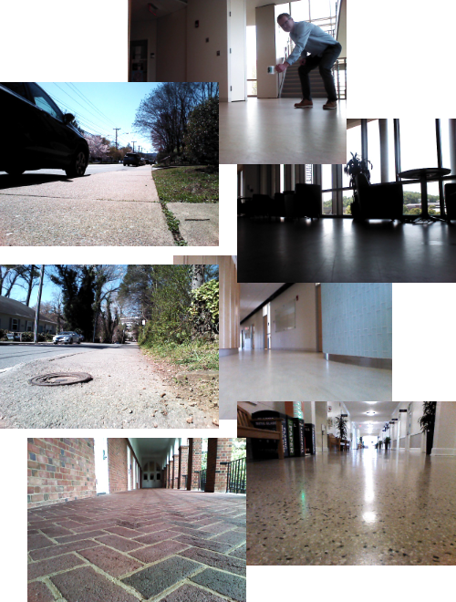
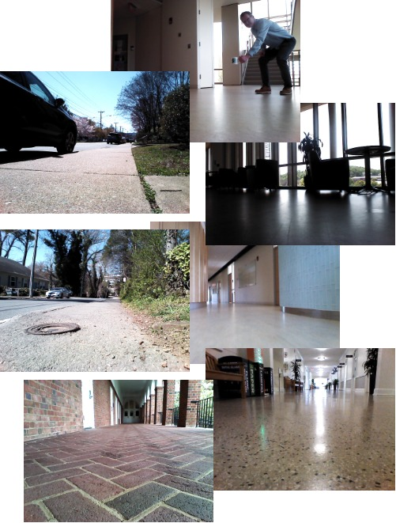
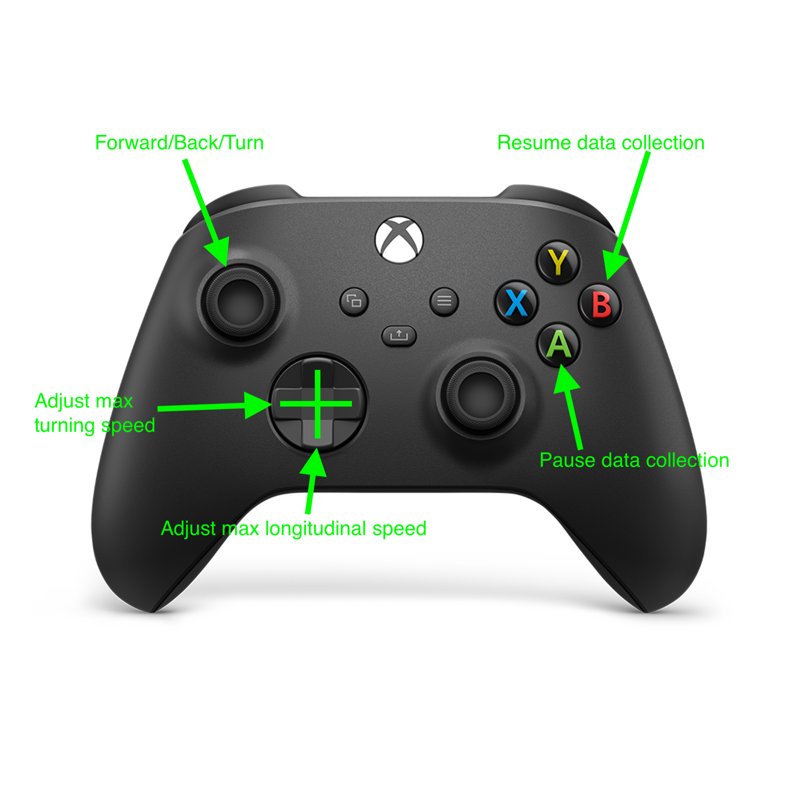

# ROSbot Dataset Collection

<p float="middle">
  
   
</p>
<!-- |   |   | -->

This repository contains instructions and source code for using the ROSbot to collect a dataset by driving around using the Husarion ROSbot 2.0.
It contains instructions to install, troubleshoot, and initialize the onboard data collection routine for the ROSbot.
It also contains training scripts for a DAVE2 steering model and pytorch implmentations of other architectures.

```python
# documentation
rosbot_basics.md
rosbot_installation.md
data_collection_quickstart.md
# data collection
start_rosbot.sh
src
├── CMakeLists.txt -> /opt/ros/noetic/share/catkin/cmake/toplevel.cmake
└── datacoll
    ├── CMakeLists.txt
    ├── launch
    │   └── data_collector.launch
    ├── package.xml
    └── src
        ├── dataset_writer.py
        └── teleop_joy_concurrent.py
# training
models/
├── DAVE2pytorch.py
├── README.md
├── ResNet.py
└── VAE.py
training/
├── DatasetGenerator.py
├── install.sh
├── requirements.txt
└── train_DAVE2.py
```
## Running the ROSbot

To charge your ROSbot, follow the Husarion [charging instructions](https://husarion.com/manuals/rosbot/#charging-rosbot).

When you are ready to drive the ROSbot around, follow these steps. 
These directions assume that you are starting with your ROSbot turned off, charged, and nothing plugged in:
1. First, find the two USB ports on the rear panel of the ROSbot. Plug the Bluetooth dongle into the right USB port (labelled XBOX) and the external data storage device into the left USB port (labelled EXT). DO NOT USE the dongle that came with the XBox controller; it only works for Windows systems.
2. Turn your XBox controller into pairing mode. This is accomplished by pressing and holding together the XBox button and the button on the back of the controller with the ")))" symbol next to it. See figure below showing which buttons to hold. When it is in pairing mode, the XBox button will show a fast steady blink. If you don't hold them down long enough, it will show a heartbeat blink.
3. Turn on your ROSbot. It will take ~10 seconds to wake up. The lidar turret will begin to spin and the fast, steady blinking XBox button on the controller will turn to constantly lit to indicate it is paired.
4. You're ready to drive :)
5. When you're ready to stop, simply toggle the on/off switch on the ROSbot. See figure below to locate the on/off switch.


ROSbot rear panel guide.


XBox controller pairing buttons (press and hold down simultaneously).

## Driving your ROSbot

Upon startup, the ROSbot immediately begins collecting datapoints at a rate of 10Hz.
Each image is 480x640 RGB and ~110KB. It collects 1GB of data approximately every 15 minutes.
Data collection can be paused by pressing A and resumed by pressing B.
The maximum turning speed can be adjusted up or down by pressing right or left on the directional pad, respectively.
The maximum longitudinal (forward/back) speed can be adjusted up or down by pressing up or down on the directional pad, respectively.
Each adjustment changes the max speed by ±0.2 on a scale of (-1, 1).

## Data collection guidelines

1. Practice driving to get a feel for the controls.
2. Choose a location to navigate. 
3. Navigate the location in the simplest way possible: maintain a constant speed, drive in the approximate center of the hallway/sidewalk/path, avoid obstacles when necessary. Don’t go into rooms or alcoves, don’t drive under chairs, stick to the clearly demarcated path (e.g. a linoleum hallway area, a hiking trail)
4. Walk out of the range of the LiDAR sensor (about 12m, see components description in [ROSbot manual](https://husarion.com/manuals/rosbot/)).
4. Drive that way for AT LEAST an hour, performing multiple laps/traversals of that location. As a human driver, your driving will vary slightly from run to run, which is fine. There is more than one "right" way to navigate a location.
5. Remove your USB stick from the ROSbot and plug it into your computer. Label your newly collected data folder with the correct date, time, and location in this style: `rosbot-<month>_<day>-<hour>_<minute>-<location>-<hash>`. 
7. Then upload your data to a networked folder, e.g. Box or a portal directory.

# Training a steering model

To set up your python environment:
```bash
# log into portal
ssh <your-id>@portal.cs.virginia.edu
git clone git@github.com:MissMeriel/ROSbot_data_collection.git
cd training
./install.sh
mkdir ../datasets
wget -O ../datasets "https://virginia.box.com/shared/static/fb9lj05cg6twkq92gh7el3q9jdu5wd1n"
```

To start training the DAVE2 model:
```bash
cd training/
./train.sh
```

# ROSbot data
Husarion puts out an annotated list of ROSbot topics via the [ROSbot API](https://husarion.com/manuals/rosbot/#ros-api).
For a full list of available ROSbot data, see [list of published topics](ROSbot-pub-topics.txt).

# ROSbot Troubleshooting

Guide to the LED output on the back: [LEDs and buttons](https://husarion.com/manuals/core2/#leds-and-buttons)

## Husarion References

* [Husarion ROS1 Tutorials](https://husarion.com/tutorials/ros-tutorials/1-ros-introduction/)
* [ROSbot simple kinematics](https://husarion.com/tutorials/ros-tutorials/3-simple-kinematics-for-mobile-robot/)
