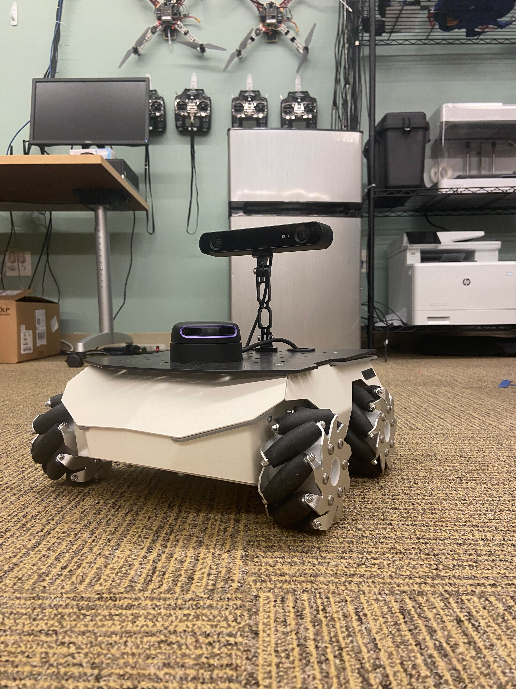

# ROSbot Dataset Collection

<p float="middle">
  
   
</p>
<!-- |   |   | -->

This repository contains instructions and source code for using the ROSbot to collect a dataset by driving around using the Husarion ROSbot XL.
It contains instructions to install, troubleshoot, and initialize the onboard data collection routine for the ROSbot.
It also contains training scripts for a DAVE2 steering model and pytorch implmentations of other architectures.


## Links
Pretrained models: https://drive.google.com/drive/folders/1lTqEC30yBuqN6IobSV73E97OaOnCGqDg?usp=sharing

Dataset: https://drive.google.com/drive/folders/1Zn7ZNDpPpw7ffnotwR8Jb-DGITRNZy0A?usp=sharing

Failure Catalog Data: TODO: GOOGLE DRIVE LINK

Supplemental video: TODO: YOUTUBE LINK


## Directory structure
```python
.
├── README.md
├── RosbotXL.md
├── data_cleaning
│   ├── clean_rosbot_data.py
│   └── data_cleaning.md
├── data_graphing
│   ├── get_angular_speeds_pub.py
│   └── make_histogram_pub.m
├── docs
│   ├── ROSbot-applications.txt
│   ├── ROSbot-pub-topics.txt
│   ├── data_collection_quickstart.md
│   ├── image
│   │   └── # documentation visual aids go here
│   ├── rosbot_basics.md
│   ├── rosbot_equipment_setup.md
│   ├── rosbot_installation.md
│   └── rosbot_usage.md
├── figures
│   └── # README visual aids go here
├── model_inference
│   ├── README.md
│   ├── inference.sh
│   └── model_inference.py
├── models
│   ├── DAVE2pytorch.py
│   ├── Chauffeur.py
│   ├── DroNet.py
│   ├── MiniRecurrent.py
│   ├── MiniTransformer.py
│   ├── ResNet.py
│   ├── onnx_tester.py
│   ├── utils.py
│   └── vit.py
├── rosbot_datasets
│   ├── # parent directories of each collection run
├── src
│   ├── final
│   │   ├── drive
│   │   │   ├── DAVE2pytorch.py
│   │   │   ├── __init__.py
│   │   │   ├── drive.py
│   │   │   ├── ros2_data_collection.py
│   │   │   └── steering_NN.py
│   │   ├── launch
│   │   │   ├── data_collection.launch.py
│   │   │   └── model_deployment.launch.py
│   │   ├── models
│   │   │   ├── 360x640_15epochs.pt
│   │   │   ├── README.md
│   │   │   ├── figure_8_20_epoch.pt
│   │   │   ├── model-360x640-30epoch-13Ksamples-best.pt
│   │   │   ├── model-DAVE2v3-135x240-lr0.001-50epoch-64batch-lossMSE-7Ksamples-INDUSTRIALandHIROCHIandUTAH-noiseflipblur-best.pt
│   │   │   ├── model_11k_12epoch.pt
│   │   │   ├── model_30k_11epoch.pt
│   │   │   ├── model_30k_40epoch.pt
│   │   │   ├── old_data_360x640.pt
│   │   │   └── straight_line_640x360.pt
│   │   ├── package.xml
│   │   ├── resource
│   │   │   └── final
│   │   ├── setup.cfg
│   │   ├── setup.py
│   │   └── test
│   │       ├── test_copyright.py
│   │       ├── test_flake8.py
│   │       └── test_pep257.py
│   └── sllidar_ros2
│       └── # sllidar source goes here
├── start_rosbotxl.sh
├── test_rosbotxl.sh
└── training
    ├── DatasetGenerator.py
    ├── README.md
    ├── README_train_DAVE2.md
    ├── Readme_DatasetGeneratory.md
    ├── Zach_DatasetGenerator.py
    ├── Zach_train_DAVE2.py
    ├── install.sh
    ├── requirements.txt
    ├── train.sh
    └── train_DAVE2.py
```


## Student offshoot projects from Fall 2023
- [RosBot 2.0](https://github.com/Taylucky/Rosbot2.0)
- [RosBot XL](https://github.com/ish-gupta/ml-robot)
