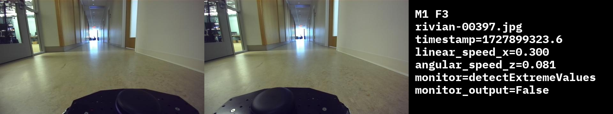

# Failure Analysis Tools

## Query

This will query the failure F3 in M1:
```$python3 query.py -m M1 -f F3  --training_metas --save```

This will query only the failures F1, F2, and F11 in M1:
```$python3 query.py -m M1 -f F1,F2,F11  --training_metas --save```

This will query all the failures in M1:
```$python3 query.py -m M1 --training_metas --save```

## Replay
Example usage: 
```$ python3 replay.py -m M1 -f F3 --monitor detectExtremeValues --save```.
This will save output to the `./replay-output/` folder

Sample replay output for static image using `detectExtremeValues` monitor:
<!-- <p float="middle">
  
</p> -->


## Summarize

```bash
$ python3 summarize.py -m M1 -f F1 -d statistical
angular_speed_z:
  total samples   192
  mean            0.0035887830156250016 
  var             0.231329970940894 
lidar_ranges:
  total samples   192
  readings        1800
  mean            1.018
  var             2.203 
```
