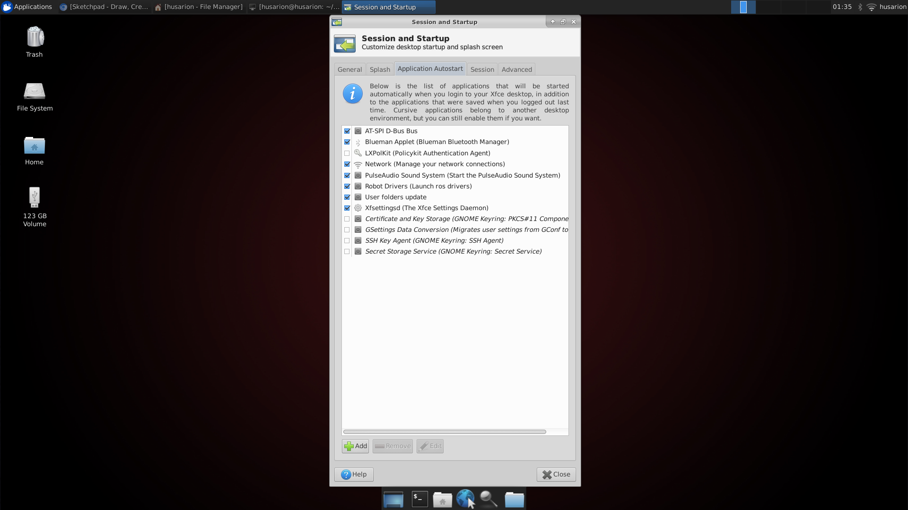
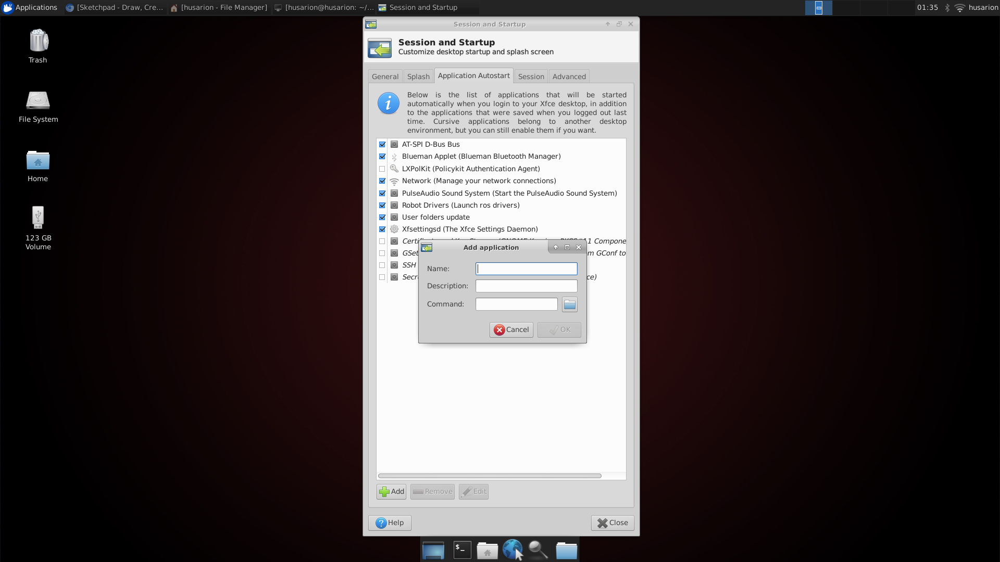
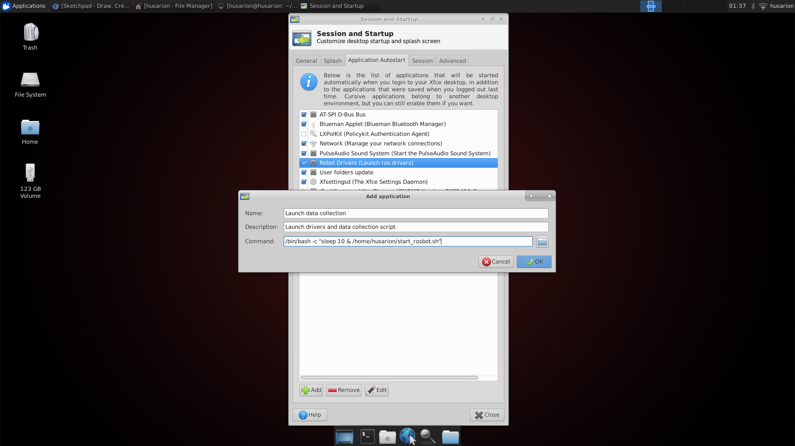

# ROSbot Setup

This document contains instructions to set up the data collection scripts on your ROSbot so you can run these scripts natively and collect a dataset.

Hardware required:
* ROSbot
* Wireless Xbox controller
* small form-factor external USB drive (like [this one](https://a.co/d/4fmXYWw))
* Bluetooth 4.0 dongle (like [this one](https://a.co/d/e7X3SpB))

## Setup Instructions

N.B. READ THE INSTRUCTIONS ALL THE WAY THROUGH AND SKIM THE TROUBLESHOOTING SECTION BEFORE YOU BEGIN. 
This will make setup a lot faster as you can make sure you have everything you need ready to go (keyboard, mouse, bluetooth dongle, wifi connection...).

1. Copy `start_rosbot.sh` file and `src` directory to your USB drive. Plug the USB drive into your ROSbot.
2. Connect to your ROSbot (ssh, plug in a monitor and mouse/keyboard, etc.).
3. Copy `start_rosbot.sh` to `~` (aka `/home/husarion`). 
4. Give `start_rosbot.sh` executable permissions by running `chmod +x start_rosbot.sh`.
5. Copy the `datacoll` package inside `src` to `~/husarion_ws/src`.
6. Add executable permissions to all `.py` scripts in the `datacoll` package: `cd ~/husarion_ws/src/datacoll/src; chmod +x *.py`
7. `cd ~/husarion_ws; source devel/setup.bash`
8. Refer to the instructions [here](https://husarion.com/tutorials/howtostart/rosbot---quick-start/#connecting-rosbot-to-your-wi-fi-network) to connect your ROSbot to wifi or ethernet.
9. Install the `joy_node` package: `sudo apt install ros-<distro>-joy`. Refer to troubleshooting for determining your distro and updating your ros repo and authentication.
10. Install `bluez` and `bluetoothctl`: ` sudo apt install bluez`
8. Do X to make sure the bluetooth stays connected
9. Try running the startup script: `./start_rosbot.sh`. If you experience errors, refer to troubleshooting.
10. If steps #8-9 run smoothly, add `./start_rosbot.sh` to your startup routine. For more detailed screenshots, see section below on adding scripts to your startup routine.
    1. Go to Dash and type "Start" into the search bar. On HusarionOS, this is the magnifying glass icon at the bottom of the screen.
    2. Double click to open "Session and Startup".
    3. Hit the "Add" icon to add a new routine to startup.
    4. Write a name and description. In the "Command" field, type `/bin/bash -c "sleep 10 & /home/husarion/start_rosbot.sh"`.
11. Test if your script starts on startup. Turn off your ROSbot and turn it back on again. The LiDAR turret should spin within 20-30 seconds. Let it run for a few seconds and then check the external USB drive to see if the dataset wrote to disk.
12. Follow the instructions linked [here](https://support.xbox.com/en-US/help/hardware-network/controller/update-xbox-wireless-controller) to update the Xbox controller firmware.
12. If step #10 goes smoothly, refer to [README.md](README.md) "ROSbot Setup" section for running the ROSbot. If you experience errors, refer to troubleshooting.

## Adding scripts to your startup routine on HusarionOS
1. Go to Dash and type "Start" into the search bar. On HusarionOS, this is the magnifying glass icon at the bottom of the screen.

2. Double click to open "Session and Startup".

3. Hit the "Add" icon to add a new routine to startup.

4. Write a name and description. In the "Command" field, type `/bin/bash -c "sleep 10 & /home/husarion/start_rosbot.sh"`.

## Troubleshooting

The apt repository preinstalled on the ROSbot may be stale and may require an update. 
Check your ros distro by running `rosverion -d` or `ls /opt/ros`.
If you cannot install new ros packages using `apt`, [update your apt repository](http://wiki.ros.org/melodic/Installation/Ubuntu) if necessary.

To install new packages from ROS and Husarion, you will need to update two GPG keys in order to access those apt repositories.
If your ROSbot was manufactured before June 2022, then ROS has updated their GPG key since your ROSbot's software was installed.
- To update your ROS apt GPG key: (link)[https://community.husarion.com/t/very-important-update-for-gpg-keys-in-ros-repositories/660]
- To update your Husarion apt GPG key: (link)[https://community.husarion.com/t/husarion-repository-expired-key/1240/6]

If you are using a wireless network and intend to operate the ROSbot outside that network, test your ROSbot startup routine when not connected to that network. 
You may need to disable the WiFi on your ROSbot to successfully complete the startup routine. 
You may also want to change the `ROS_IP` set in `start_rosbot.sh`.

Here's a [reference](https://net2.com/how-to-run-applications-at-startup-on-ubuntu-18-04/) for adding scripts to an Ubuntu 18 LSB system.

Extra docs from Ubuntu to install `bluez`: [link](https://ubuntu.com/core/docs/bluez/install-configure/install)
